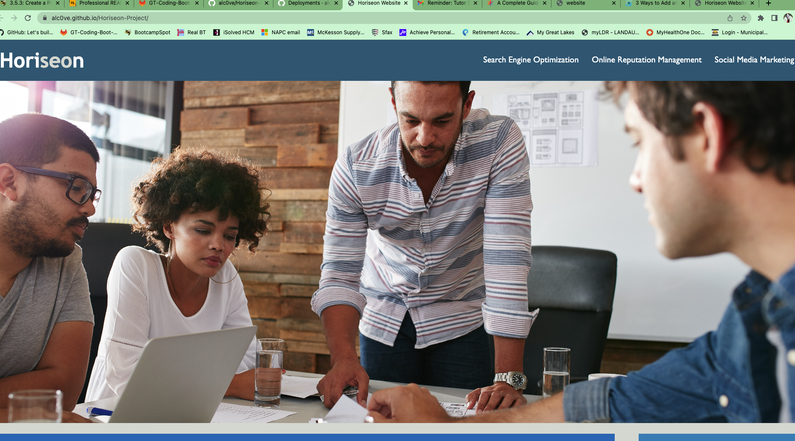

# Horiseon-Project

## Description

The Horiseon group needed a code refacted for a webpage to make it more accessible for those with disabilities, thus getting the full experience of the webpage. Some of the code in CSS file could be condensed down to take up less lines and a bit more easily readable. The html file was cleaned up to include semantic html providing meaning to the code written. 

## Installation

A lot of the div tags in the html file were changed to semantic html tags.
CSS file had a lot of separate elements with the same description, so they were condensed by alike features to shorten the length of the entire file.
All things were done while keeping website to look as is.

## Usage

Link to see deployed finished project: https://alc0ve.github.io/Horiseon-Project/


Screenshot of deployed webpage:

    ```md
    
    ```

## Credits

Thank you to Celeste, the TA, for helping me get started. 
Thank you to Scott M., the tutor, to provide tips and tricks.
Thank you to a lot of my classmates going through this with me!!!
